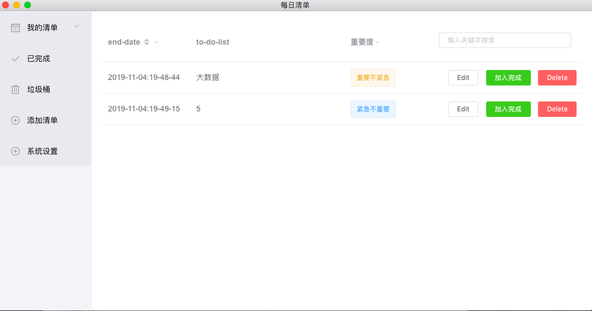

# 每日清单

> 一个基于Electron-Vue的to-do-list
#### Build Setup

``` bash
# 安装依赖
npm install
或 cnpm install（推荐）


# serve with hot reload at localhost:9080
npm run dev
或者 yarn dev（本地有的话）

# 打包成可执行程序
npm run build

# run unit & end-to-end tests
npm test


```

---




已完成功能：
1. 登录
2. 增删改查